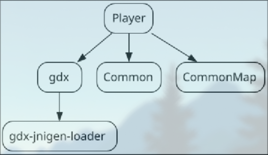

# Module Based Game

## About

This project aims to deliver a module based game, which is implemented using [libGDX](https://libgdx.com/).

### Authors
* Magnus Ahrens Thomsen (magth23@student.sdu.dk)
* Oliver Ahrens (olahr23@student.sdu.dk)
* Victor Bøgesvang Pedersen (vpede23@student.sdu.dk)
* Victor Kahl Petersen (vipet23@student.sdu.dk)

## Installing

### Prerequisites

Before building the game, you'll have to first clone the source code:

```sh
git clone https://github.com/Emerald-Edgers/Game.git
cd Game
```

Before building the game ensure you have the following installed:

* [Maven](https://maven.apache.org/download.cgi) (>= 3.9.0)
* [Java](https://adoptium.net/) (>= 21)


### Building
Build the project by running `mvn clean install` from the project root.


### Running
Run the project with `java -cp "mods-mvn/*" dk.ee.zg.Game` From the project root.
Alternatively use the provided script: [run.sh](run.sh)

### Development
For development purposes use the script: [install-run.sh](install-run.sh)

The script executes the following commands:

```sh
mvn clean install
java -cp "mods-mvn/*" dk.ee.zg.Game
```

#### Intellij IDEA
If using Intellij IDEA it is possible to setup a [Run Configuration](https://www.jetbrains.com/help/idea/run-debug-configuration.html) which automatically runs a shell script.
For convenience this project provides a preconfigured configuration at [.intellij-game-run](.intellij-game-run).

### Defining interface implementations
If a module implements an interface from another module it should be defined under META-INF/services/_path-to-interface-from-module-root_
Inside the file, define which class implements said interface in the same manner.


### Generating Dependcy graphs
```sh
mvn depgraph:graph -DoutputDirectory=target/dependency-graphs
``` 
using this command can build .cdot dependency graphs for all modules
e.g
